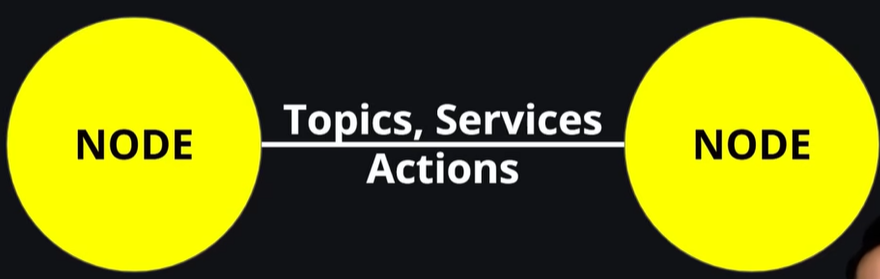
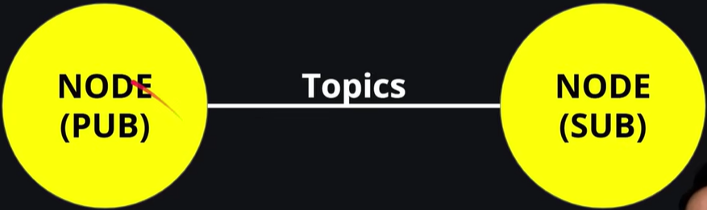
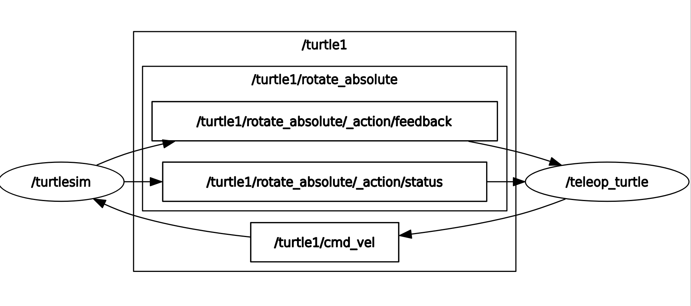
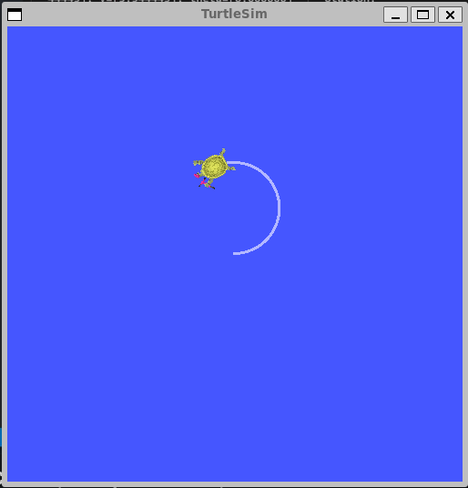

## Basic Concepts

ROS 2 is a middleware based on a strongly-typed, anonymous publish/subscribe mechanism that allows for message passing between different processes.

### Nodes


ROS works with nodes, where nodes are responsible for sending an receiving data. We can do this using **Topics**, **Services**, **Actions**.

```
ros2 node list # View running nodes
ros2 node info /turtlesim # View Subscribers, Publishers, Service Servers, Action Servers, Action Clients related to a pkg.
```

### Topics



On the left we have Publisher node and on the right we have subscriber node. The Publisher node is going to send data to a topic, and the subscriber node is going to subscribe to that topic to receive that data.

- See list of topics:
```
ros2 run turtlesim turtlesim_node
ros2 run turtlesim turtle_teleop_key

ros2 topic list # See the list of topics
ros2 topic list -t # See the type associated with these topics
```

- Start rqt_graph to see topics
```
rqt_graph # Better visualization of the topics
```

- See topic output. Move with teleop to see output after running command
```
ros2 topic echo <topic_name>
ros2 topic echo /turtle1/cmd_vel # As we move the turtle, this is going to output the topic
```

- See topic info
```
ros2 topic info /turtle1/cmd_vel # Provides the number of publishers and subscriptions on the topic.
```



Here, node /teleop_turtle is publishing to topic /turtle1/cmd_vel, and node /turtlesim is subscribed to topic /turtle1/cmd_vel. Arrow to a topic means the node is publishing to the topic, arrow from a topic means the node is subsribed to a topic. 

- View interface definition
```
ros2 interface show geometry_msgs/msg/Twist
```

- Publish data to topic ("--once" means publish once and exit)
```
ros2 topic pub --once /turtle1/cmd_vel geometry_msgs/msg/Twist "{linear: {x: 2.0, y: 0.0, z: 0.0}, angular: {x: 0.0, y: 0.0, z: 1.8}}"
```


Here, we as the publisher try to publish a message "{linear: {x: 2.0, y: 0.0, z: 0.0}..." to topic /turtle1/cmd_vel using it's definition geometry_msgs/msg/Twist. The turtlesim node is the subscriber. It's constantly listening to the /turtle1/cmd_vel topic and moves the turtle based on whatever velocity commands it receives.

```
ros2 topic pub --rate 1 /turtle1/cmd_vel geometry_msgs/msg/Twist "{linear: {x: 2.0, y: 0.0, z: 0.0}, angular: {x: 0.0, y: 0.0, z: 1.8}}"
```
With this the turtle keeps moving in circle. We can publish this info to /turtle1/pose using:
```
ros2 topic echo /turtle1/pose
```
Running `rqt_graph` while this will show /turtlesim node publishing to /turtle1/pose

### Services

Unlike Topics where stream of data is continuously being published or subscribed, services maintain a server and client relationship. Here client will request some data and server will respond before the client can receive the data.

```
ros2 run turtlesim turtlesim_node
ros2 run turtlesim turtle_teleop_key

ros2 service list
ros2 service list -t

ros2 service type /clear # Identify service type from service
ros2 service find std_srvs/srv/Empty # Find services from service type
```

- View interface
```
ros2 interface show turtlesim/srv/Spawn
```

- Calling services
```
ros2 service call <servce_name> <service_type> <arguments>
ros2 service call /spawn turtlesim/srv/Spawn "{x: 2.0, y: 2.0, theta: 0.2, name: ''}"
```
Spawns a new turtle at the provide argument locations.

### Parameters

When you want to input data into a node, it's convenient to pass parmaters into the node. This is specially helpful if you have different configurations for different robots. Similar to having inputs to a function, but here our function is a node.

- In a new terminal
```
ros2 run turtlesim turtlesim_node
ros2 run turtlesim turtle_teleop_key
```

- View parameters list
```
ros2 param list
```

- Get parameter value (Parameter names retrieved from the previous list)
```
ros2 param get /turtlesim background_g
```

- Set param value
```
ros2 param set /turtlesim background_g 255
```

- View all params for a node
```
ros2 param dump /turtlesim
```
